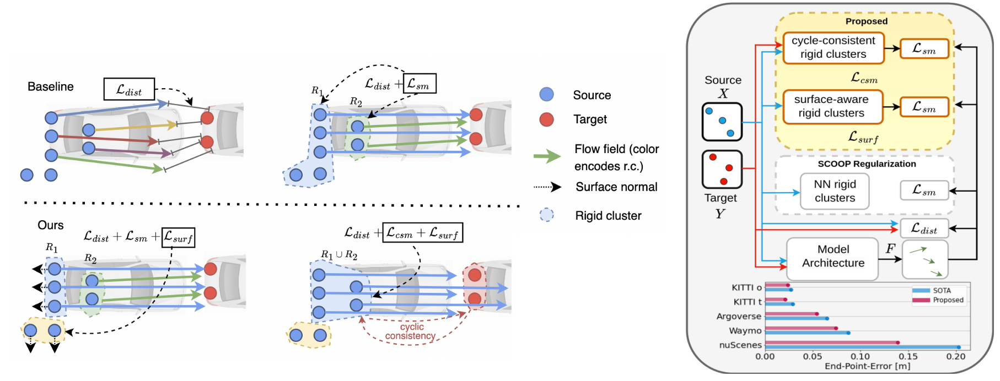
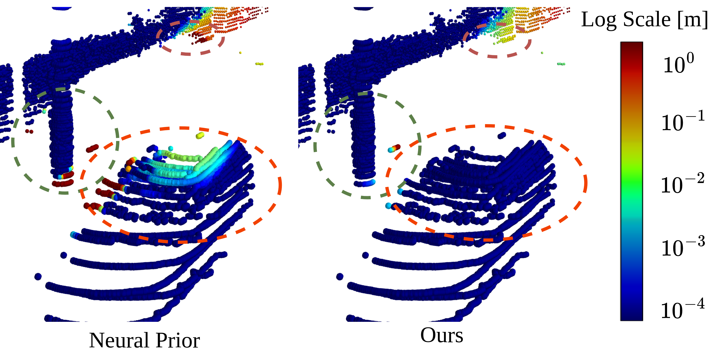
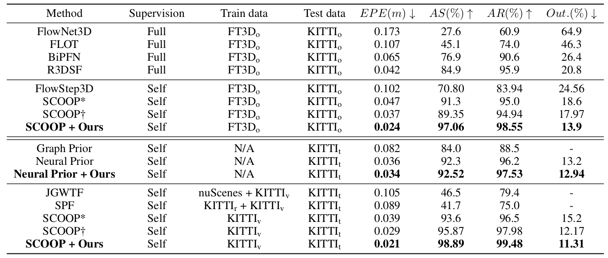
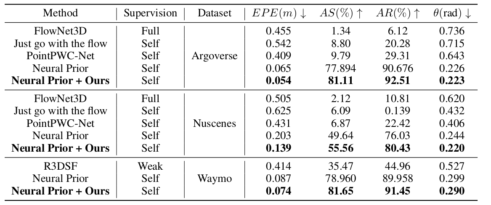

# Self-supervised 3D Scene Flow via Surface-Aware Cyclic Smoothness (Under Review AAAI 2024)



## Download data

Download data [here](https://login.rci.cvut.cz/data/lidar_intensity/sceneflow/data_sceneflow.tgz), unpack it to the home folder (use symlink if necessary):

```console
tar -xvf data_sceneflow.tgz $HOME/data/sceneflow
```

## Install dependencies

- Install [PyTorch3d](https://github.com/facebookresearch/pytorch3d) with CUDA support.
- Tested with:
  - Python 3.10.4
  - PyTorch 2.0.0 (CUDA-11.7.0)
  - PyTorch3D/0.7.3 (CUDA-11.7.0)

## Run experiments

Go to the repository directory (we are assuming you installed the code in `$HOME/pcflow`):
```console
cd $HOME/pcflow
```

and execute commands based on config files in

```console
$HOME/pcflow/configs/experiments/
```

### Neural Prior and SCOOP experiments

change the config file on line 10 in 'scripts/single_gpu' to the desired experiment .csv file and run the command with
the desired row experiment id (we included the different datasets in benchmarking on each row):

```console
python scripts/single_gpu $row
```

where $row is the index of the experiment in the .csv file. We included base_scoop.csv and base_nfs.csv for baseline experiments
and ours_scoop.csv and ours_nfs.csv for our method.

### Example of error in evaluation



### Results on KITTI-SF



### Results on LiDAR benchmarks


